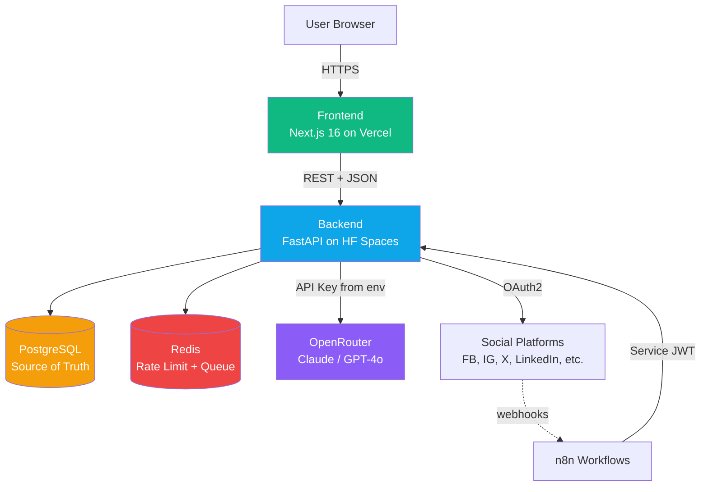
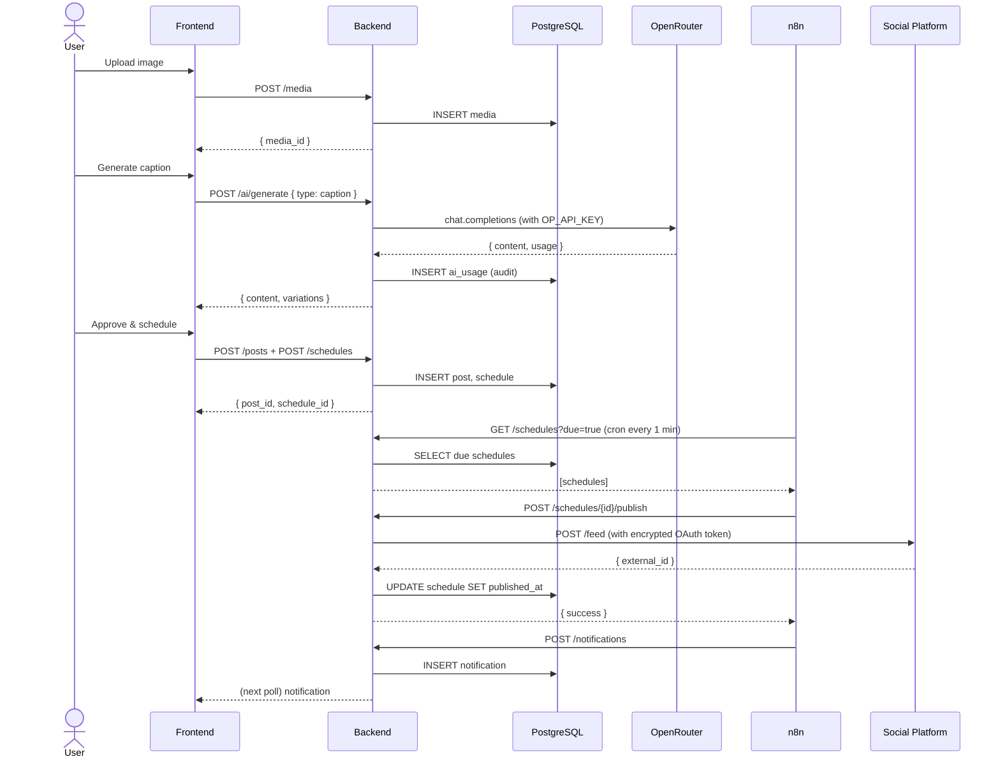
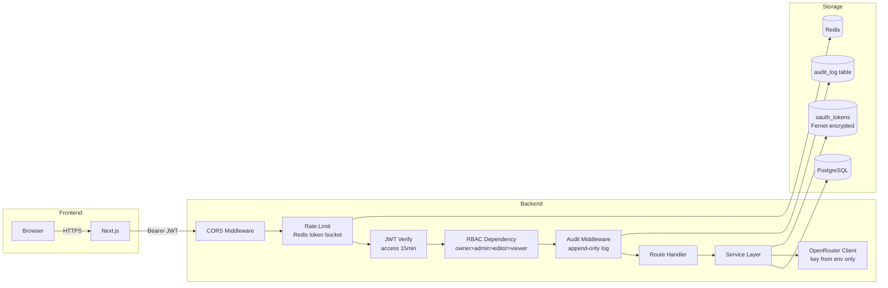

# SocialConnect AI — Architecture Diagram

## High-Level Topology

```
                    ┌──────────────────────┐
                    │      User Browser     │
                    └──────────┬───────────┘
                               │ HTTPS
                    ┌──────────▼───────────┐
                    │  Frontend (Vercel)    │
                    │  Next.js 16 + TS      │
                    │  Tailwind + shadcn/ui │
                    └──────────┬───────────┘
                               │ REST + JSON
                    ┌──────────▼───────────┐
                    │  Backend (HF Spaces)  │
                    │  FastAPI + Python     │
                    │  JWT + RBAC + Rate    │
                    └──┬─────┬─────┬───────┘
                       │     │     │
              ┌────────▼┐ ┌──▼──┐ ┌▼──────────┐
              │PostgreSQL│ │Redis│ │OpenRouter │
              │(source)  │ │rl+q│ │(AI LLM)   │
              └─────────┘ └────┘ └───────────┘
                                               
                    ┌──────────────────────┐
                    │   n8n Workflows      │
                    │  (cloud or self)     │
                    └──────────┬───────────┘
                               │ authenticated REST
                               ▼
                          Backend API
                                               
                    ┌──────────────────────┐
                    │  Social Platforms    │
                    │  (OAuth2 + publish)  │
                    └──────────────────────┘
```

## Mermaid version



## Request Flow — Campaign Publish (Golden Path)



## Security Architecture



## Deployment Topology

```
GitHub: getalvi/socialconnect
    │
    ├── push to main ──────────────────────┐
    │                                      │
    │                                      ▼
    │                              ┌───────────────┐
    │                              │    Vercel     │
    │                              │  (frontend)   │
    │                              │  socialconnect│
    │                              │  .vercel.app  │
    │                              └───────────────┘
    │
    └── backend/ folder ───────────────────┐
                                           │
                                           ▼
                                  ┌─────────────────┐
                                  │  HF Spaces      │
                                  │  (Docker)       │
                                  │  getalvi-       │
                                  │  socialconnect  │
                                  │  .hf.space      │
                                  │                 │
                                  │  OP_API_KEY ←   │
                                  │  HF Secret      │
                                  └─────────────────┘
                                           │
                                           ▼
                                  ┌─────────────────┐
                                  │ External DB +   │
                                  │ Redis (Neon +   │
                                  │ Upstash)        │
                                  └─────────────────┘
```
